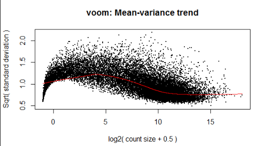

```{r setup, include=FALSE}
knitr::opts_chunk$set(echo = FALSE, message = FALSE)
devtools::load_all()
library(tidyverse)
```

# Motivation

When sequencing RNA (RNA-seq), the measured quantity is the number of *reads* mapping to individual genes. The measurement in RNA-seq is subject to notable noise both due to the measurement process itself and due to biological variability - even identical cells after undergoing identical treatment will vary to some extent in the amount of RNA for a specific gene. Most commonly, the noise is modelled as negative binomial. This works reasonably well in many cases, but it ignores an important aspect of RNA-seq: the last step of the measurement is actually multinomial sampling as the sequences "compete" for limited capacity of the sequencing machine. I.e. the total number of reads does not (in most experiments) depend on the total RNA in the sample but on the amount of sequencing capacity dedicated for the sample. Therefore considering the data as independent negative binomial variables can introduce spurious negative correlations and other artifacts to the dataset. Those are partially alleviated by various normalization techniques used in the field, but we hope we can do better.

Since negative binomial has both good track record and good theoretical reasons to capture the biological variability, we are interested in working with a distribution that would "put multinomial on top of independent negative binomials".

# The Gamma-multinomial distribution

Informally speaking, putting multinomial sampling "on top of" independent Poisson variables results in multinomial distribution, e.g. the Poisson variance is already captured by the multinomial distribution. Since negative binomial can be treated as Gamma-Poisson mixture, we can treat negative binomial-multinomial as Gamma-multinomial, more precisely:

$$
Y \sim Multinomial(\frac{\theta_1}{\sum \theta_i}, ...,\frac{\theta_n}{\sum{\theta_i}}) \\
\theta_i \sim Gamma(\alpha_i, \beta_i)
$$
Where $\theta_i$ are latent variables while $\alpha_i$ and $\beta_i$ come from a deeper level of the model and they are constrained so that $\sum E(log(\theta_i)) = 0$. I use the shape-rate parametrization of the Gamma distribution.

I am interested in the (logarithm of) marginal distribution 
$$
P(Y | \alpha_{1..n}, \beta_{1..n}) = \int Multinomial(Y|\Theta) \prod_i Gamma(\theta_i | \alpha_i, \beta_i) d \Theta
$$

I know that in the special case of $\beta_1 = \beta_2 = ... = \bar\beta$, the marginal distribution is Dirichlet Multinomial (DM). The DM distribution however does not fit the RNA-seq data, the data are more dispersed than what the DM distribution can accomodate. 

I believe DM does not fit the data because DM arises from multinomial sampling of negative binomial variables with a fixed Fano factor (mean/variance ratio) - see e.g. [my Cross Validated question on the topic]( https://stats.stackexchange.com/questions/359728/analytically-solving-sampling-with-or-without-replacement-after-poisson-negative). Neg. binomial is Gamma-Poisson, where the $\beta$ parameter determines the Fano factor. But RNA-seq corresponds to multinomial sampling of neg. binom variables where the Fano factor varies.

I don't believe there is an analytic solution for $P(Y | \alpha_{1..n}, \beta_{1..n})$ in the general case, but would it be possible to write an approximation or have a numerical integration scheme that would let me to compute the (log of) this density efficiently? It feels like the structure of independent Gammas could be somehow exploitable (in fact, the integral may be restated to be over i.i.d Gammas taking advantage of the Gamma's scaling properties).

# Attempted approaches

Note that while I tried to do my best, it is possible that I made a mistake and some of those approaches actually work, so if you believe an approach *should* work, it might be that I implemented it badly.

## Explicit $\theta$ with Stan

Treating $\theta_{1..n}$ as explicit latent variables in a Stan model fits the data reasonably well (see below for more detailed analysis). However, this is very slow even for small $n$ due to the large number of latent variables - I need one latent varialbe for each measure value for each gene.

## Monte-Carlo

I've tried a naive Monte-carlo scheme (sample from the gammas, compute the multinomial density, average over samples) which was hopelessly slow to converge even with few dimensions. The problem seems to be that for many parameter values, the Gamma densities and/or the multinomial density create a sharp ridge, so when sampling from the Gamma's only few samples end up contributing non-negligible amoutns to the integral. I've tried a simple importance sampling scheme, using samples from the Dirichlet distribution as proposals for $\theta_1 / \sum \theta_i$ (to sample near the maximum likelihood area of the multinomial), but that only made things worse, probably because this ends up missing the bulk of the Gamma distribution.

```{r}
y = c(500,500)
alpha = c(10, 30)
beta =  c(10, 60)
tibble(theta_1 = seq(0.01,5, length.out = 100)) %>% crossing(tibble(theta_2 = seq(0.01,5, length.out = 100))) %>%
  rowwise() %>%
  mutate(multinom = dmultinom(y, prob = c(theta_1, theta_2), log = TRUE), gamma = sum(dgamma(c(theta_1,theta_2), alpha, beta,log = TRUE)), total = multinom + gamma) %>%
  ungroup() %>%
  gather("type","prob", multinom, gamma, total) %>%  
  ggplot(aes(x = theta_1, y = theta_2, fill = prob)) + geom_raster() + scale_fill_distiller(palette = "Spectral") + facet_wrap(~type)
```

```{r}
plot_density_contributions <- function(y, alpha, beta) {
  tibble(theta_1 = seq(0.01,5, length.out = 100)) %>% crossing(tibble(theta_2 = seq(0.01,5, length.out = 100))) %>%
    rowwise() %>%
    mutate(multinom = dmultinom(y, prob = c(theta_1, theta_2)), gamma = prod(dgamma(c(theta_1,theta_2), alpha, beta)), total = multinom * gamma) %>%
    ungroup() %>%
    gather("type","density", multinom, gamma, total) %>%  
    group_by(type) %>%
    mutate(relative_density = density / max(density)) %>%
    ggplot(aes(x = theta_1, y = theta_2, fill = relative_density)) + geom_raster() + scale_fill_distiller(palette = "Spectral") + facet_wrap(~type)
}
```


```{r, fig.width = 7, fig.height=2.5, fig.cap="Density relative to the mode for the gamma and multinomial densities alone and for the total density. Here, the total is dominated by the gamma contribution when using $Y = (500,500), \\alpha = (30,30), \\beta = (10,60)$"}
plot_density_contributions(y = c(500,500), alpha = c(30, 30), beta =  c(10, 60))
```


```{r, fig.width = 7, fig.height=2.5, fig.cap="Density relative to the mode for the gamma and multinomial densities alone and for the total density. Here, the total is dominated by the gamma contribution when using $Y = (5,5), \\alpha = (30,30), \\beta = (10,60)$"}
plot_density_contributions(y = c(5,5), alpha = c(30, 30), beta =  c(10, 60))
```


```{r}
y = c(0,15)
tibble(p1 = seq(-10,2, length.out = 100)) %>% 
  crossing(tibble(p2 = seq(-10,2, length.out = 100))) %>%
  rowwise() %>%
  mutate(prob = dmultinom(y, prob = exp(c(p1,p2))) * dgamma(exp(p1), 1, 10) * dgamma(exp(p2), 1.99, 0.1)) %>%
  ggplot(aes(x = p1, y = p2, fill = prob)) + geom_raster() + scale_fill_distiller(palette = "Spectral")

```


## Laplace approximation

I've tried to find the Laplace approximation to $P(log(\Theta)|X, \alpha_i, \beta_i)$  which looks reasonably Gaussian-like for many parameter combinations, but turns out to be problematic, as when e.g. $x_i = 0$ and $\alpha_i \leq 1$, the mode is not defined. It is also likely difficult to numerically find the mode when it exists. $P(\Theta|X, \alpha_i, \beta_i)$ does not resemble Gaussian at all.

## Gamma-multinomial as conditional negative binomial

When parametrizing the negative binomial via mean and Fano factor, such that when $X \sim NB(\mu,\theta)$ then $E(X) = \mu$ and $Var(X) = \mu(1 + \theta)$, we get a nice rule for sum of n.b. variables:

$\forall i: X_i \sim NB(\mu_i, \theta)$ implies

$\sum X_i \sim NB(\sum \mu_i, \theta)$

This lets us write the Dirichlet-Multinomial density as:

$$
\frac{\prod NB(x_i | \mu_i, \theta)}{NB(\sum x_i | \sum \mu_i, \theta)}  
=DM(x_1, ..., x_n| \theta^{-1}\mu_1, ... , \theta^{-1} \mu_n)
$$
So what happens when we use the parametrization of negative binomial via mean and inverse-overdispersion, such that when $X \sim NB(\mu,\phi)$ then $E(X) = \mu$ and $Var(X) = \mu + \frac{\mu^2}{\phi}$ and we let both $\mu$ and $\phi$ vary? In this case $\sum x_i$ no longer belongs to a simple family of distributions, but a very good approximation to the distribution of $\sum x_i$ can be obtained via the saddlepoint approximation.

However, for reasons I don't completely understand it turns out that the distribution

$$
P(x_1,...,x_n|\mu_1,...\mu_n,\phi_1,...\phi_n) = \frac{\prod NB(x_i | \mu_i, \phi_i)}{P(\sum x_i | \mu_1,...\mu_n,\phi_1,...\phi_n)}  
$$
is not a Gamma-multinomial, even though the equivalence holds for the DM special case above. (Given the relationship between Gamma and Negative binomial, we would expect $\alpha_i = \phi_i, \beta_i = \frac{\phi_i}{\mu_i}$.)

# Evidence Gamma-multinomial might be a better model



TODO: replicate the mean-variance trend with gamma multinomial

